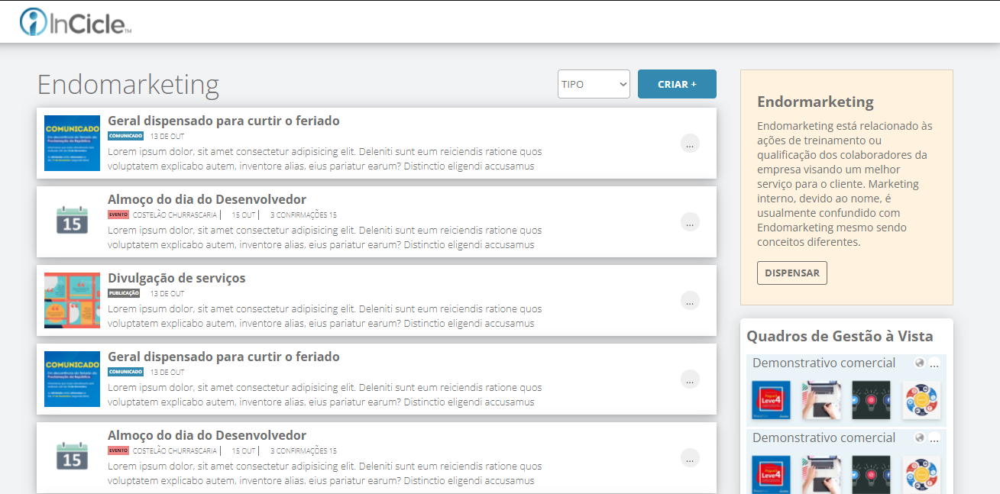
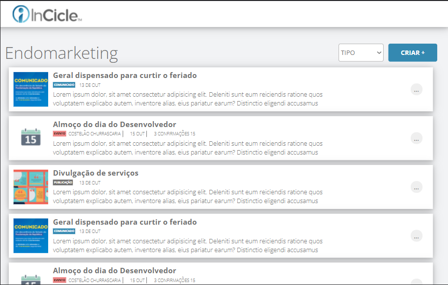
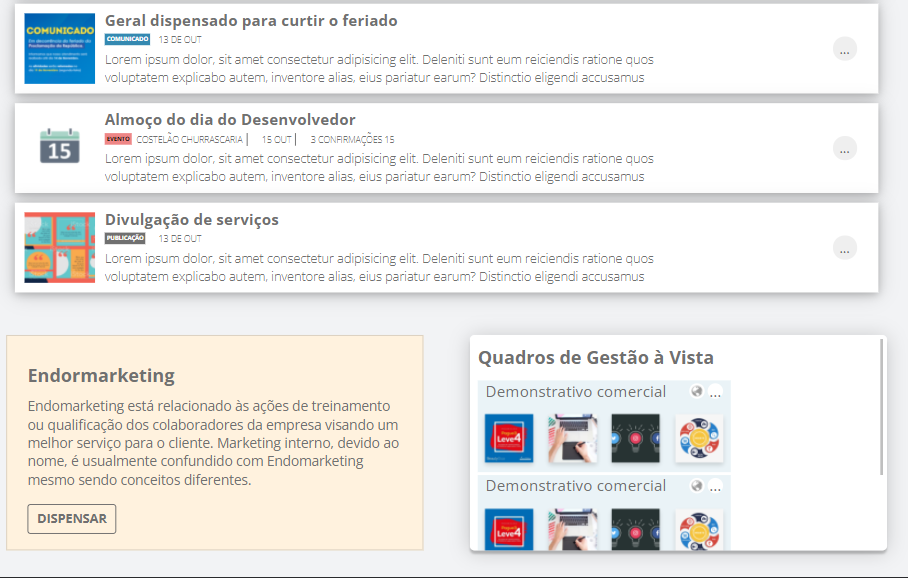
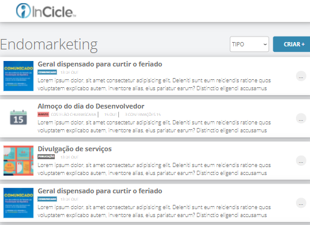
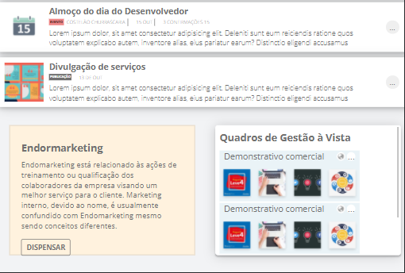

# Endomarketing
Teste oferecido pela **InCicle** com o objetivo contrar para a vaga de web design. É uma empresa promissora e se mostra respeitosa (o digo pelo contato que tive, embora eletrônico) Foi testado o conhecimento em `CSS5 Grid`, `Flexbox`, `Layout`e `Responsividade` e `arquitetura do CSS5` dentre vários aspectos.

Me diverti bastante, me estressei também. Segue algumas telas do que foi feito:
#### 1 Parte superior da tela inteira:

#### 2 Parte superior da tela inteira com 960px:

#### 3 Parte inferior da tela:

#### 4 Parte superior da tela inferior à 720px:

#### [5] Parte inferior da tela inferior à 720px:

## Modo de uso:
 - Faça o download do código (pode usar Git clone, ou baixar como zip, recomendo o zip é mais simples).
 - Desfragmentar com o algum software de sua preferência.
 - Acesse a pasta `src` e abra o arquivo `index`, e *voila* a página vai abrir com o navegador de sua preferência.
### Recomendações e bugs:
Infelizmente não superei um bug que deixou o meu layout desconfigurado no **Quadro de gestão à vista** em telas pequenas.
O CSS está bem legível, penso eu, então, está aberto para fazeres qualquer melhoria e subir um pullrequest.

**Recomendo fortemente** aprender a usar o git ou git desktop, porque manusear (controlar a versão) o seu código com ele é "lei" hoje.
